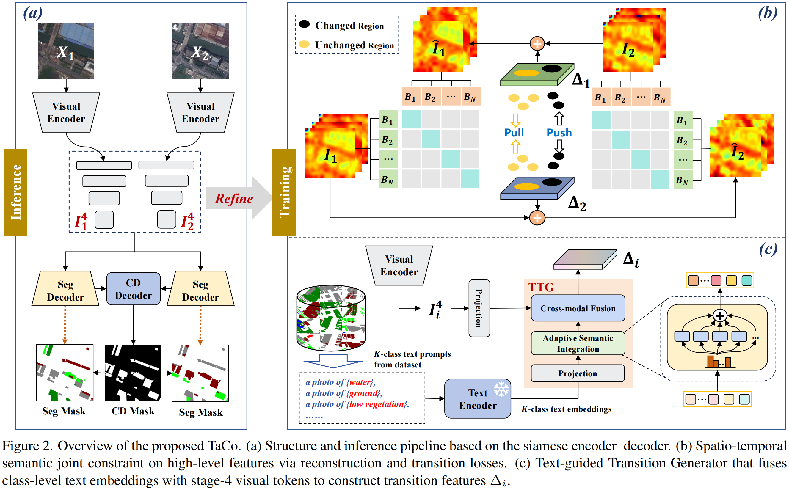

# TaCo

📄 **Paper**: https://arxiv.org/abs/2511.20306

**TaCo** is a spatio-temporal semantic consistent network for remote sensing change detection. 

Unlike conventional mask-supervised methods that focus primarily on spatial differences, TaCo conceptualizes change detection as a **semantic transition** between bi-temporal states.

## Overview

  

TaCo is built upon a siamese encoder–decoder architecture and introduces a **spatio-temporal semantic joint constraint** to complement conventional mask supervision.
The core idea is to treat change as a semantic transition, where the feature representation of one temporal state can be conceptually reconstructed from the other via learned transition features.

To realize this, TaCo incorporates:

- **Text-guided Transition Generator (TTG)**, which integrates class-level textual semantics with bi-temporal visual features to construct cross-temporal transition features.
- **Spatio-temporal semantic joint constraint**, consisting of bi-temporal reconstruction constraints and a transition constraint, to enforce temporal semantic consistency and enhance discriminability in changed regions.

Importantly, all semantic transition modeling is applied **only during training**,
introducing **no additional computational overhead at inference time**.

## Key Characteristics

- Models change as a semantic transition rather than a pure spatial difference
- Leverages textual category priors as semantic anchors during training
- Supports both **binary change detection (BCD)** and **semantic change detection (SCD)**
- Improves temporal semantic consistency without modifying the inference pipeline

## Status

The official PyTorch implementation is currently being organized and will be released in a future update.

## License

This project is licensed under the Apache License 2.0.
